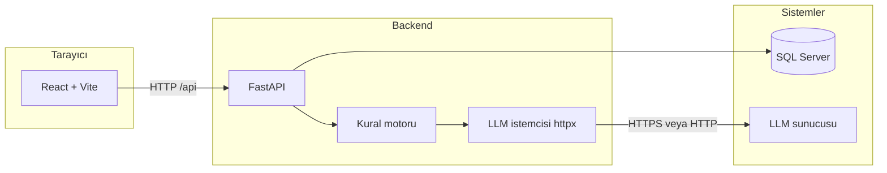

# DWH Code Review (AI SQL Code Review)

SQL Server üzerindeki nesneleri (stored procedure, view, function vb.) seçerek veya yapıştırılan SQL ile **yayımlanmış kurallara göre** LLM destekli inceleme yapan; sonuçları web arayüzünde gösteren ve **CSV / SQL** olarak dışa aktarmayı destekleyen kurumsal bir araçtır.

Bu depo, **Windows geliştirme ortamında** (PowerShell) minimum tıklama ile ayağa kalkacak şekilde düzenlenmiştir; üretimde ortam değişkenleri ve ağ politikaları `docs/ADMIN_GUIDE.md` ile hizalanmalıdır.

---

## İçindekiler

1. [Özellikler](#özellikler)
2. [Mimari](#mimari)
3. [Teknoloji yığını](#teknoloji-yığını)
4. [Dokümantasyon haritası](#dokümantasyon-haritası)
5. [Önkoşullar](#önkoşullar)
6. [Hızlı başlangıç](#hızlı-başlangıç)
7. [Manuel kurulum](#manuel-kurulum)
8. [Ortam değişkenleri](#ortam-değişkenleri-backendenv)
9. [REST API özeti](#rest-api-özeti)
10. [Güvenlik ve kurumsal ortam](#güvenlik-ve-kurumsal-ortam)
11. [Sorun giderme](#sorun-giderme)
12. [Proje yapısı](#proje-yapısı)

---

## Özellikler

| Alan | Açıklama |
|------|-----------|
| **Veri kaynağı** | SQL Server — ODBC ile bağlantı; veritabanı ve nesne listeleme, nesne tanımı çekme. |
| **İnceleme** | Nesne bazlı veya yapıştırılan script; kurallar `backend/data` altında yönetilir (taslak / yayın). |
| **LLM** | LM Studio veya uyumlu sunucu; `api_v1_chat` veya OpenAI uyumlu `chat/completions` API seçenekleri. |
| **Canlı ilerleme** | Streaming uçları ile kural bazlı ilerleme ve sonuç toplama. |
| **Dışa aktarma** | İnceleme sonuçları için CSV; düzeltme yorumları ile SQL indirme. |
| **Yönetim** | Kurallar, LLM yapılandırması ve isteğe bağlı LLM günlük meta verisi (üretimde ham payload kapalı tutulmalı). |
| **Güvenlik** | İsteğe bağlı API ve admin anahtarları, hız limiti, LLM için private ağ zorunluluğu, tanımlanabilir HTTP User-Agent. |

---

## Mimari



**Akış (özet):** kullanıcı nesne veya SQL seçer → backend tanımı okur veya metni alır → yayımlanmış kurallar için LLM çağrıları yapılır → sonuçlar API ile arayüze döner.

---

## Teknoloji yığını

| Katman | Bileşen | Not |
|--------|---------|-----|
| Backend | Python **3.10+** (öneri: 3.12), FastAPI, Uvicorn | `backend/requirements.txt` sabit sürümler |
| Veritabanı | **pyodbc**, ODBC Driver 17/18 for SQL Server | Bağlantı dizesi `MSSQL_*` |
| HTTP istemcisi | **httpx** | LLM çağrıları; proxy için `LLM_HTTP_TRUST_ENV` |
| Frontend | **Node.js 18+**, React, Vite | Geliştirme: `npm run dev` (port **5173**) |
| Yapılandırma | **pydantic-settings**, `.env** | `backend/.env` |

---

## Dokümantasyon haritası

| Rol | Belge | İçerik |
|-----|--------|--------|
| **Son kullanıcı** | [docs/USER_GUIDE.md](docs/USER_GUIDE.md) | Günlük inceleme, menüler, dışa aktarma |
| **Sistem yöneticisi** | Bu README + [docs/ADMIN_GUIDE.md](docs/ADMIN_GUIDE.md) | Kurulum, LLM, güvenlik, EDR/DLP, proxy |
| **Operasyon / IT** | [docs/KURULUM_CHECKLIST.md](docs/KURULUM_CHECKLIST.md) | Teslim onayı, yazdırılabilir kontrol listesi |

Arayüzde sol menüde **Kullanıcı** ve **Sistem** bölümleri ayrıdır; ağır sayfalar ihtiyaca göre yüklenir.

---

## Önkoşullar

Aşağıdakilerin kurulu ve erişilebilir olduğundan emin olun:

1. **Python 3.10+** (geliştirme için PATH’te `python` veya `py`)
2. **Node.js 18+** ve `npm`
3. **ODBC Driver 17 veya 18 for SQL Server**
4. **SQL Server** erişimi (bağlantı dizesi hazır)
5. **LLM endpoint** (ör. LM Studio, iç ağ IP’si veya Tailscale)

Hızlı kontrol (PowerShell):

```powershell
python --version
node --version
npm --version
Get-OdbcDriver | Where-Object { $_.Name -match "SQL Server" }
```

---

## Hızlı başlangıç

Depo kökünde (önerilen yöntem):

```powershell
.\start.ps1
```

`start.ps1` şunları yapar:

1. **8000** ve **5173** portlarındaki uygun süreçleri temizler (`scripts/dev-stop-common.ps1`).
2. `backend\.env` yoksa `backend\.env.example` dosyasından oluşturur.
3. `backend\.venv` yoksa oluşturur ve `requirements.txt` ile bağımlılıkları kurar/günceller.
4. Backend’i **127.0.0.1:8000** üzerinde başlatır ve `/api/health` ile doğrular.
5. Gerekirse `frontend` için `npm install` çalıştırır.
6. Vite geliştirme sunucusunu başlatır (**Ctrl+C** ile durdurulunca backend de sonlandırılır).

**Adresler:**

| Servis | URL |
|--------|-----|
| API | http://127.0.0.1:8000 |
| Arayüz | http://localhost:5173 |
| Sağlık | http://127.0.0.1:8000/api/health |

### Durdurma

- `start.ps1` çalışırken: pencerede **Ctrl+C** (backend ile birlikte kapanır).
- Ayrı kökte **`.\stop.ps1`** ile 8000 ve 5173 üzerindeki ilgili süreçler temizlenebilir.

---

## Manuel kurulum

Tek komut yerine adım adım kurmak için:

### 1) Ortam dosyası

```powershell
Copy-Item .\backend\.env.example .\backend\.env
```

`backend/.env` içinde en azından bağlantı ve LLM alanlarını doldurun (aşağıdaki tabloya bakın).

### 2) Backend sanal ortam

```powershell
cd backend
python -m venv .venv
.\.venv\Scripts\python.exe -m pip install --upgrade pip
.\.venv\Scripts\python.exe -m pip install -r requirements.txt
```

### 3) Backend çalıştırma

```powershell
cd ..
.\backend\.venv\Scripts\python.exe -m uvicorn main:app --app-dir .\backend --host 127.0.0.1 --port 8000 --reload
```

### 4) Frontend

```powershell
cd frontend
npm install
npm run dev
```

Sağlık kontrolü:

```powershell
Invoke-WebRequest -UseBasicParsing http://127.0.0.1:8000/api/health
```

Beklenen örnek: `{"status":"ok","rules_api":true}` (alan adları sürüme göre değişebilir).

---

## Ortam değişkenleri (`backend/.env`)

| Değişken | Açıklama |
|----------|-----------|
| `MSSQL_CONNECTION_STRING` | SQL Server ODBC bağlantı dizesi |
| `LLM_CHAT_API` | `api_v1_chat` (LM Studio tarzı) veya `openai` uyumlu uç |
| `LLM_BASE_URL` / `LLM_CHAT_URL` | LLM kök veya tam sohbet URL’si |
| `LLM_MODEL` / `SQL_REVIEW_LLM_MODEL` | Model adı; inceleme için `SQL_REVIEW_LLM_MODEL` önceliklidir |
| `LLM_API_KEY` | Gerekirse (barındırıcı istemiyorsa boş) |
| `LLM_HTTP_TRUST_ENV` | `true`: sistem `HTTP(S)_PROXY` kullanılır; yerel LAN LLM için genelde `false` |
| `LLM_HTTP_USER_AGENT` | İsteğe bağlı; LLM isteklerinde sabit tanımlayıcı (log/DLP) |
| `LLM_ENFORCE_PRIVATE_NETWORK` | `true`: LLM hedefi private/Tailscale dışına çıkışı engeller |
| `LLM_ALLOW_PUBLIC_HOSTS` | Virgülle hostname istisnaları |
| `LLM_LOG_FULL_PAYLOADS` | Üretimde **`false`** tutun |
| `SQL_REVIEW_MAX_CONCURRENT_RULES` | Eşzamanlı kural sayısı (ör. 4–8) |
| `LLM_READ_TIMEOUT_SECONDS` / `LLM_REQUEST_RETRIES` | Ağ ve sıra gecikmeleri için |
| `SQL_REVIEW_TWO_PART_THRESHOLD_CHARS` | Çok uzun SQL için iki parçalı analiz eşiği |
| `CORS_ORIGINS` | İzinli tarayıcı kökenleri |
| `API_ACCESS_TOKEN` | Doluysa `/api/*` için `X-API-Key` ( `/api/health` hariç ) |
| `API_ADMIN_TOKEN` | Yönetim uçları için `X-Admin-Key` |
| `API_RATE_LIMIT_*` | İnceleme uçlarında hız limiti |

Örnek kurumsal iskelet:

```env
MSSQL_CONNECTION_STRING=Driver={ODBC Driver 18 for SQL Server};Server=...;Database=...;Trusted_Connection=yes;Encrypt=yes;TrustServerCertificate=yes;
LLM_CHAT_API=api_v1_chat
LLM_BASE_URL=http://100.x.x.x:1234/v1
LLM_MODEL=your/model
SQL_REVIEW_LLM_MODEL=your/model
LLM_HTTP_TRUST_ENV=false
LLM_ENFORCE_PRIVATE_NETWORK=true
LLM_LOG_FULL_PAYLOADS=false
SQL_REVIEW_MAX_CONCURRENT_RULES=6
CORS_ORIGINS=http://localhost:5173,http://127.0.0.1:5173
```

---

## REST API özeti

| Yöntem | Yol | Amaç |
|--------|-----|------|
| GET | `/api/health` | Sağlık (genelde anahtarsız) |
| GET | `/api/databases` | Veritabanı listesi |
| GET | `/api/objects` | Nesne listesi |
| GET/PUT/POST | `/api/rules`, `/api/rules/draft`, `/api/rules/publish` | Kurallar |
| GET/PUT | `/api/llm-config` | LLM yapılandırması |
| GET/DELETE | `/api/llm-logs`, `/api/llm-logs/{id}` | LLM günlük meta |
| POST | `/api/review`, `/api/review/stream` | Nesne inceleme |
| POST | `/api/review/script`, `/api/review/script/stream` | Yapıştırılan script |
| POST | `/api/object-definition` | Nesne tanımı |

Koruma ve anahtarlar için `docs/ADMIN_GUIDE.md` bölümlerine bakın.

---

## Güvenlik ve kurumsal ortam

Üretimde tipik ayarlar: `LLM_ENFORCE_PRIVATE_NETWORK=true`, `LLM_LOG_FULL_PAYLOADS=false`, CORS ve `API_ACCESS_TOKEN` / `API_ADMIN_TOKEN` kurum politikasına göre. Kurumsal proxy için `LLM_HTTP_TRUST_ENV` ile birlikte ortam `HTTP(S)_PROXY` değerleri uyumlu olmalıdır. LLM istekleri sabit **User-Agent** kullanır (`LLM_HTTP_USER_AGENT` ile değiştirilebilir).

EDR, DLP ve ağ izolasyonu için teknik notlar **[docs/ADMIN_GUIDE.md](docs/ADMIN_GUIDE.md)** içindeki *Kurumsal kontrollerle uyum* bölümündedir.

---

## Sorun giderme

| Belirti | Olası çözüm |
|---------|-------------|
| `Node.js / npm not found` | Node.js LTS kurun, terminali yeniden açın |
| `Failed to fetch` | Backend ayakta mı (`/api/health`); port çakışması için `start.ps1` veya `stop.ps1` |
| LLM bağlantı hatası | `LLM_BASE_URL`, firewall, LM Studio dinleme adresi; private ağ politikası |
| `ReadTimeout` | `SQL_REVIEW_MAX_CONCURRENT_RULES` düşürün; modelin yüklü olduğundan emin olun |
| `All connection attempts failed` | Yanlış proxy: yerel LLM için `LLM_HTTP_TRUST_ENV=false` deneyin |

---

## Proje yapısı (özet)

```
DWHCodeReview/
├── backend/           # FastAPI uygulaması
│   ├── main.py
│   ├── config.py
│   ├── data/          # İnceleme kuralları (ör. review_rules.json)
│   ├── db/
│   ├── models/
│   └── services/
├── frontend/          # React + Vite
├── docs/              # Kullanıcı ve yönetici kılavuzları
├── scripts/           # Geliştirme yardımcıları (ör. port temizliği)
├── start.ps1
├── stop.ps1
└── README.md
```

---

## Kurulum sonrası doğrulama

1. Arayüzde veritabanı seçimi yapılabiliyor mu?
2. En az bir nesne veya script ile inceleme tamamlanıyor mu?
3. Canlı ilerleme ve sonuç kartları görünüyor mu?
4. CSV / SQL dışa aktarma beklendiği gibi mi?
5. `/api/health` başarılı mı?

Operasyonel onay için **[docs/KURULUM_CHECKLIST.md](docs/KURULUM_CHECKLIST.md)** kullanılabilir.

---

**Özet:** `.\start.ps1` ile geliştirme ortamını ayağa kaldırın, `backend/.env` ile SQL Server ve LLM’i bağlayın, üretim ve güvenlik için **ADMIN_GUIDE** ve kontrol listesini takip edin.
